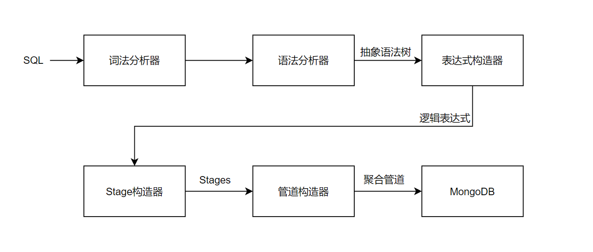
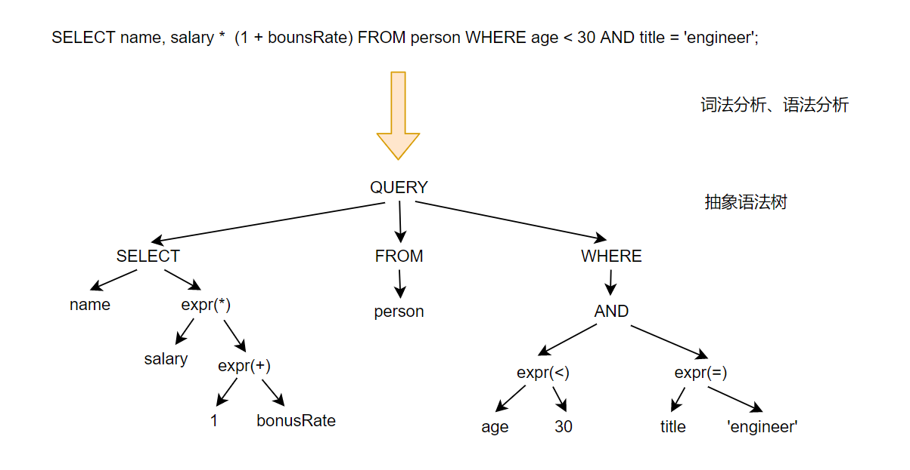
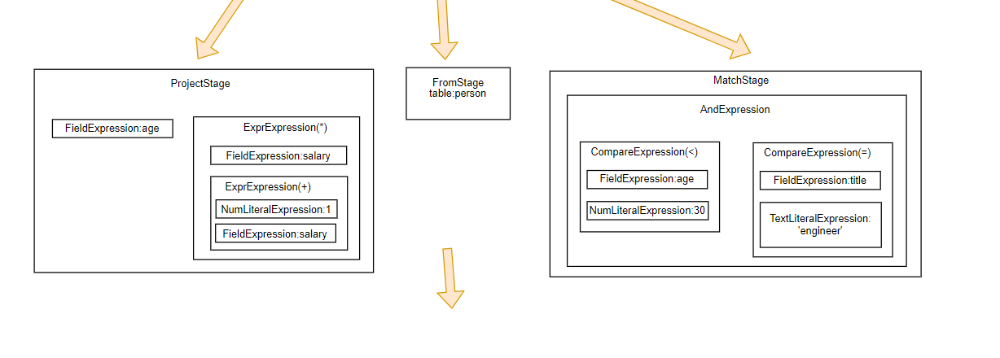

## 简述

借助该库，你可以用类似SQL语法来查询MongoDB的数据：

```java
String sql = "SELECT *,field_1 AS f1,field_2, type FROM test WHERE name LIKE '\\^'";
BaseMongoProvider provider = new BaseMongoProvider(mongoTemplate());
List<Object> list = provider.query(sql, Object.class);
```

### 快速开始

**引入依赖**

```xml
<dependency>
    <groupId>com.github.walterinkitchen</groupId>
    <artifactId>MQLParser</artifactId>
    <version>1.0.8-SNAPSHOT</version>
</dependency>
```

**使用**

```java
String ql = "SELECT *, field_1 AS f1 FROM test ORDER BY field_1 ASC LIMIT 10";
MongoProvider provider = new BaseMongoProvider(mongoTemplate);
List<Object> result = provider.query(ql, Object.class);
```

## 工作流程

**解析流程：**



**解析示例：**





```json
[
    {
        "$addFields": {
            "id": {
                "$toString": "$_id"
            }
        }
    },
    {
        "$match": {
            "$expr": {
                "$and": [
                    {
                        "$lt": [
                            "$age",
                            {
                                "$numberDecimal": "30"
                            }
                        ]
                    },
                    {
                        "$eq": [
                            "$title",
                            "engineer"
                        ]
                    }
                ]
            }
        }
    },
    {
        "$project": {
            "name": "$name",
            "MULTI": {
                "$multiply": [
                    "$salary",
                    {
                        "$add": [
                            {
                                "$numberDecimal": "1"
                            },
                            "$bounsRate"
                        ]
                    }
                ]
            }
        }
    },
    {
        "$project": {
            "_id": 0
        }
    }
]
```


## 文档

[语法说明与示例](doc/语法.md)

